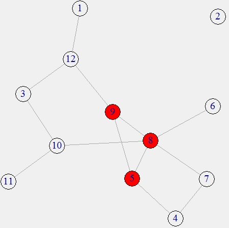
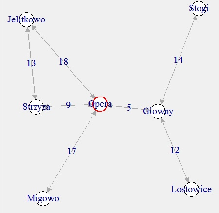

# graph-theory

## Adjecency

Number of triangles in an undirected graph G is equal to tr(A^3)/6, where A is an adjacency matrix of G. Each vertex that forms triangle has different colour.
[wiki](https://en.wikipedia.org/wiki/Adjacency_matrix#Properties)

## Kirchoff's theorem

Calculating the number of spanning trees in a graph.
[wiki](https://en.wikipedia.org/wiki/Kirchhoff%27s_theorem)

## Dijkstra

Create weighted graph and calculate shortest paths from Lostowice
[wiki](https://en.wikipedia.org/wiki/Dijkstra%27s_algorithm)

