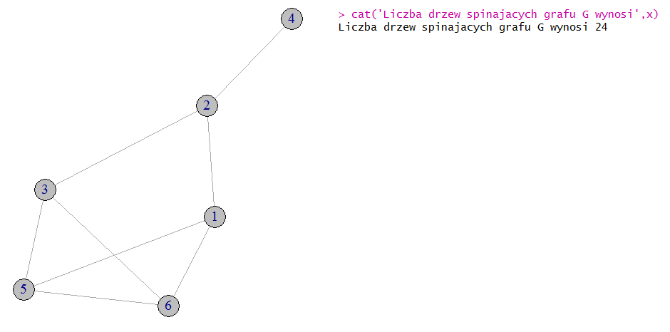

# Selected algorithms

## [Adjacency](https://github.com/lemoniada/graph-theory/blob/master/adjacency.R)

Number of triangles in an undirected graph G is equal to tr(A^3)/6, where A is an adjacency matrix of G. Each vertex that forms triangle is colored on red.
[Wikipedia](https://en.wikipedia.org/wiki/Adjacency_matrix#Properties)

Example output:

## [Kirchoff's theorem](https://github.com/lemoniada/graph-theory/blob/master/kirchoffs-theorem.R)

Calculating the number of spanning trees in a graph.
[Wikipedia](https://en.wikipedia.org/wiki/Kirchhoff%27s_theorem)

Example output:

## [Dijkstra](https://github.com/lemoniada/graph-theory/blob/master/dijkstra.R)

Create weighted graph and calculate shortest paths from Lostowice.
[Wikipedia](https://en.wikipedia.org/wiki/Dijkstra%27s_algorithm)

Example output:

## [Floyd-Warshall](https://github.com/lemoniada/graph-theory/blob/master/floyd-warshall.R)

Having an adjacency matrix, calculate the shortest paths.
[Wikipedia](https://en.wikipedia.org/wiki/Floyd–Warshall_algorithm)

Example output:

